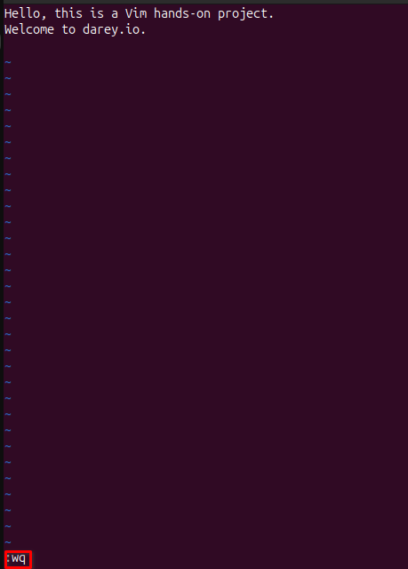

# Linux Text Editors
Linux Text Editors are software programs used for creating and editing text files within the Linux operating system. These editors come in two main types: command-line based (like `vim`, `nano`, and `emacs`) and graphical user interface (GUI) based (like `gedit` and `Kate`). Text editors are essential for tasks such as coding, configuration editing, writing documentation, and managing system files. They provide users with powerful features like syntax highlighting, search/replace functionality, and automation through scripts, making them an integral tool for developers and system administrators in managing and manipulating plain text data efficiently. let's dive into use of some these text editors.

## Vim Text Editor
Vim Text Editor is a highly efficient and powerful command-line-based text editor for Linux (and other systems). It is an improved version of the older `vi` editor, offering advanced features like multi-level undo, customizable key bindings, syntax highlighting, and a wide range of plugins. Vim is known for its steep learning curve but offers unparalleled speed and flexibility once mastered. It allows users to perform complex text manipulations quickly with a focus on keyboard commands, making it particularly favored by developers, system administrators, and power users who work extensively with code and configuration files. Vim is lightweight, highly customizable, and available in almost every Linux distribution by default, making it an essential tool for many users.

### Installing Vim 
---
To install Vim on your Linux system, you can use the package manager specific to your distribution. Here are the installation commands for some popular distributions:

**Debian/Ubuntu-based systems:**
``` bash
sudo apt update 
sudo apt install vim 
```

**Fedora:**
``` bash 
sudo dnf install vim
```

**CentOS/RHEL:**
``` bash
sudo yum install vim
```

**Arch Linux:**
``` bash 
sudo pacman -S vim
```
Once installed, you can launch Vim by typing `vim` in the terminal.


### Working With `vim`
---
- Open a new file named example.txt in Vim:
``` bash
vim exercise.txt
```
- Vim starts in Normal mode. To start typing, you need to enter Insert mode.
Press `i` to start inserting text.
Once in Insert mode, you can type normally.
Type in below text:
``` bash
Hello, this is a Vim hands-on project.
Welcome to darey.io.
```


- To stop editing and return to Normal mode, press the `Esc` key. To save your changes and quit, then type `:wq` and press `Enter`, `w` stands for write and `q` stands for quit. 
``` bash
:wq
```


- Use `cat` to display content of `exercise.txt`


## Nano Text Editor
Nano is a lightweight, easy-to-use text editor for the command line in Linux (and other Unix-based systems). Unlike Vim, which has a steep learning curve, Nano is designed to be user-friendly and intuitive, making it a popular choice for beginners. It’s perfect for quickly editing configuration files, scripts, or text documents directly from the terminal. Nano offers essential text editing features, such as search, copy-paste, and cut functionality, all controlled with simple keyboard shortcuts, making it an ideal tool for those who prefer simplicity over complexity.

### Installing Nano
---
To install Nano on your Linux system, you can use the package manager specific to your distribution. Here are the commands for some popular distributions:

**Debian/Ubuntu-based systems:**
``` bash
sudo apt update 
sudo apt install nano 
```

**Fedora:**
``` bash 
sudo dnf install nano
```

**CentOS/RHEL:**
``` bash
sudo yum install nano
```

**Arch Linux:**
``` bash 
sudo pacman -S nano
```
Once installed, you can launch Nano by typing `nano` in the terminal.


### Working With `nano`
---
- Open a new file named `nano_project.txt` in Nano:
``` bash
nano nano_project.txt
```
- Nano opens in text editing mode, so you can begin typing immediately. It’s designed to be as intuitive as possible. Type this:

``` bash
Hello, this is a Nano hands-on project.
Welcome to darey.io.
```

- Save your changes by pressing `Ctrl + O` (this stands for "Write Out").
Nano will prompt you to confirm the file name. Press `Enter` to save.

- To cut and paste text, place the cursor at the start of the text you want to cut and press `Ctrl + K`. To paste the cut text, move the cursor to the desired location and press `Ctrl + U`.

- To exit Nano, press `Ctrl + X`.
If you haven’t saved your changes, Nano will ask whether you want to save them. Press `Y` to save your work, or `N` to exit without saving. If you choose `Y`, Nano will ask you to confirm the file name (press `Enter` to confirm).

- To search for specific text, press `Ctrl + W`, type your search term, and press `Enter`.


- Open existing file with 

    ``` bash
    nano nano_project.txt
    ```

- Use `cat` to display content of `nano_project.txt`


## Conclusion
In this guide, we’ve explored two of the most commonly used text editors in Linux: Vim and Nano.

- Vim is a robust and highly customizable editor, perfect for users who need powerful text manipulation tools and are willing to invest time in learning its commands and workflows. Once mastered, Vim provides unparalleled speed and efficiency, especially for tasks like coding and system configuration.

- Nano, on the other hand, is a simpler, more user-friendly option for those who want to quickly edit text files without diving into complex key bindings. It’s ideal for beginners or anyone who values ease of use over advanced features. With its intuitive controls and minimal learning curve, Nano is great for quick edits, script writing, and handling system configurations with ease.

Both editors have their place in the Linux ecosystem, and the choice between them largely depends on your needs and comfort level. Vim is perfect for users who need a more comprehensive and efficient editing experience, while Nano is great for simple, everyday tasks where you don’t need all the bells and whistles.

Ultimately, becoming proficient in either of these editors will enhance your productivity and make working in the terminal more efficient and enjoyable.

 
